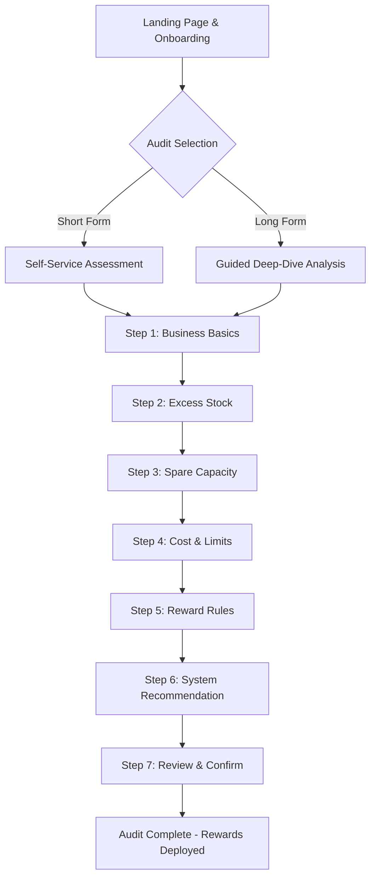

# 247GBS Audit Platform Flow Walkthrough

This document outlines the complete end-to-end journey for a business entering the **Excess Stock & Spare Capacity Audit Platform**. The primary goal of this flow is to identify unused resources (stock, time, space) and transform them into customer-generating rewards.

---

## High-Level Journey Map

---

## Detailed Step-by-Step Flow

### 1. Landing Page & Entry
Businesses arrive at the platform via the landing page, designed to explain how idle resources can be turned into revenue. 
- **Features:** Interactive video explaining the audits, seasonal importance, and token-based access.
- **Access Logic:** Members of the 247GBS directory use tokens (whose value depends on membership tier). Non-members use a pay-as-you-go model (Stripe/PayPal).

### 2. Welcome & Identification (Screen 1)
Upon starting, the user sees a welcome message personalized with their **Business Owner Name, Directory ID, and Audit ID**.
- **Crucial Message:** *"Please complete this audit as accurately as possible, as it will impact your final results and recommendations."*

### 3. Business Basics (Screen 2)
The system establishes the business's foundational profile.
- **Data Collected:** Business Name, Type (e.g., Hotel, Restaurant, Salon), Location, and Operational Hours.
- **Dynamic Logic:** The selected Business Sector and Niche dynamically alter background visuals and question logic for the remainder of the audit.

> [!NOTE]
> Sector selection is highly granular (e.g., Hospitality -> Restaurants -> Ghost Kitchen), ensuring tailored calculations later on.

### 4. Excess Stock (Screen 3)
The business identifies physical inventory or prepaid services that are not moving.
- **Questions Asked:** What is sitting on shelves? What might expire?
- **Data Points:** Product Name, Normal Selling Price, Quantity Available, Normal Time to Sell.

### 5. Spare Capacity (Screens 4 & 5)
This section captures lost revenue due to empty time slots or unused physical space.
- **Questions Asked:** Daily customer capacity vs. actual served? Quiet days? Empty time slots?
- **Data Points:** Service Type (room, seat, appointment), Total Slots, Used Slots, Normal Price.
- **Industry Specifics:** (e.g., For restaurants: % of kitchen equipment idle, tables set but unused).

### 6. Cost and Limits (Screen 6)
To protect the business's margins, they define their financial floor.
- **Data Points:** Cost to provide one unit, lowest acceptable price without taking a loss.

> [!IMPORTANT]
> This step ensures the platform's core rule: **No reward causes the business to lose money.**

### 7. Reward Rules (Screen 7)
The business determines how the capacity/stock translates into an offer.
- **Input:** How much value they are willing to give as a reward vs. how much must be paid in cash.
- **Example:** A $100 hotel room = $40 reward value + $60 cash requirement.

### 8. System Recommendation (Screen 8)
The core engine of the platform calculates the inputs and presents a strategic plan.
- **Output:** Identifies which items become rewards, their assigned value, and the remaining cash price.
- **Reward Formats:** Gift cards, cashback offers, free add-ons, bonus services.

### 9. Review and Confirm (Screen 9)
A final checkpoint before deployment.
- **Action:** User reviews a full summary of their stock, capacity, and the generated rewards. They must confirm accuracy to proceed.

### 10. Audit Complete (Screen 10)
The data is finalized and pushed to the broader ecosystem.
- **Outcomes:** Rewards are created in 247GBS and sent to MCOM Rewards. The data now powers referrals and loyalty programs.

---

## The Two Audit Paths

> [!TIP]
> The platform offers two distinct paths to cater to different business sizes and urgencies.

**Short Form Audit**
*   **Vibe:** Fast, self-service, instant snapshot.
*   **Best For:** Simple business models wanting a quick health check.

**Long Form Audit**
*   **Vibe:** Deep, guided, strategic.
*   **Best For:** Complex operations, multi-revenue streams.
*   **Features:** Extended questions, scenario forecasting, optional AI/Account Manager support.
